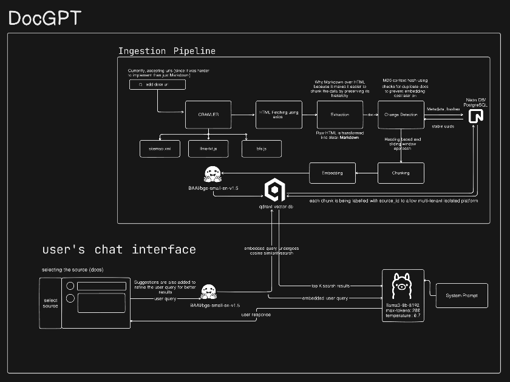

# DocGPT - AI-Powered Documentation RAG 🚀

DocGPT is a high-performance **Retrieval-Augmented Generation (RAG)** system designed to transform static documentation into interactive, intelligent chat experiences. By leveraging a modern AI stack, DocGPT autonomously crawls documentation, generates high-dimensional vector embeddings, and provides contextually aware responses using local and cloud-based LLMs.

---

## 📺 How does it work?

<div align="center">
  <video src="./DocGPT.mp4" width="100%" controls>
    Your browser does not support the video tag.
  </video>
</div>

---

## 🏗️ Architecture

The system follows a modular pipeline architecture, separating ingestion, storage, and retrieval layers to ensure scalability and low-latency performance.



---

## 🛠️ Tech Stack

<div align="center">
  
  
  
</div>

<div align="center">
  <sub><b>Node.js • Express.js • PostgreSQL • React.js • Qdrant DB • Hugging Face • Ollama</b></sub>
</div>

### Core Tech Stack:
1.  **Node.js**: The robust foundation for the backend architecture.
2.  **Express.js**: Streamlined server-side routing and API management.
3.  **PostgreSQL**: Metadata storage and relational data management.
4.  **React.js**: Front-end framework for a dynamic, responsive user interface.
5.  **Ollama**: Local LLM execution for enhanced privacy and offline intelligence.
6.  **Hugging Face**: Powering state-of-the-art embedding and inference models.
7.  **Qdrant DB**: High-performance vector storage for fast, semantic retrieval at scale.

---

## ✨ Key Features

-   **🔍 Intelligent Ingestion**: Automated recursive crawling of web-based documentation with smart rate-limiting.
-   **🧠 Multi-Model RAG**: Seamlessly switch between local (Ollama) and cloud-based (Groq/OpenAI) LLMs.
-   **⚡ Vector Search**: Leverages Qdrant for semantic retrieval, ensuring the AI only answers based on your private data.
-   **📅 Smart Scheduling**: Built-in cron jobs for periodic documentation updates and indexing.
-   **💬 Modern UI**: Markdown support, syntax highlighting, and fluid animations for a premium chat experience.

---

## 🚀 Getting Started

### Prerequisites
-   [Node.js](https://nodejs.org/) (v18+)
-   [PostgreSQL](https://www.postgresql.org/)
-   [Ollama](https://ollama.com/) (For local LLM support)
-   [Docker](https://www.docker.com/) (Optional, for Qdrant)

### Installation

1.  **Clone the Repository**
    ```bash
    git clone https://github.com/your-username/DocGPT.git
    cd DocGPT
    ```

2.  **Server Setup**
    ```bash
    cd server
    npm install
    # Configure your .env file based on .env.example
    npm run dev
    ```

3.  **Client Setup**
    ```bash
    cd client
    npm install
    npm run dev
    ```

### Ingestion Pipeline
To start indexing documentation, run the following command in the server directory:
```bash
npm run ingest
```

---

## 📜 License

This project is licensed under the MIT License - see the [LICENSE](LICENSE) file for details.

---

<div align="center">
  Built with ❤️ by the DocGPT Team
</div>
